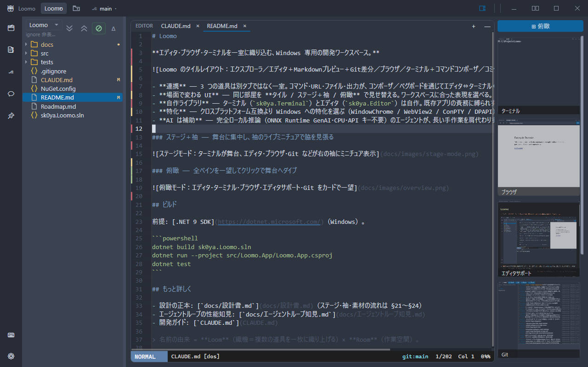
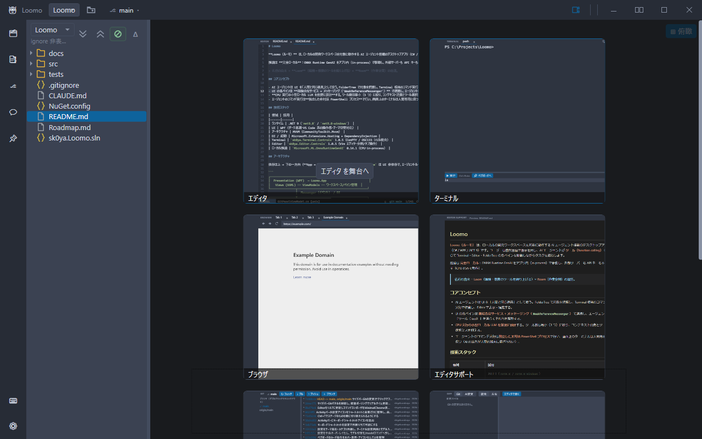
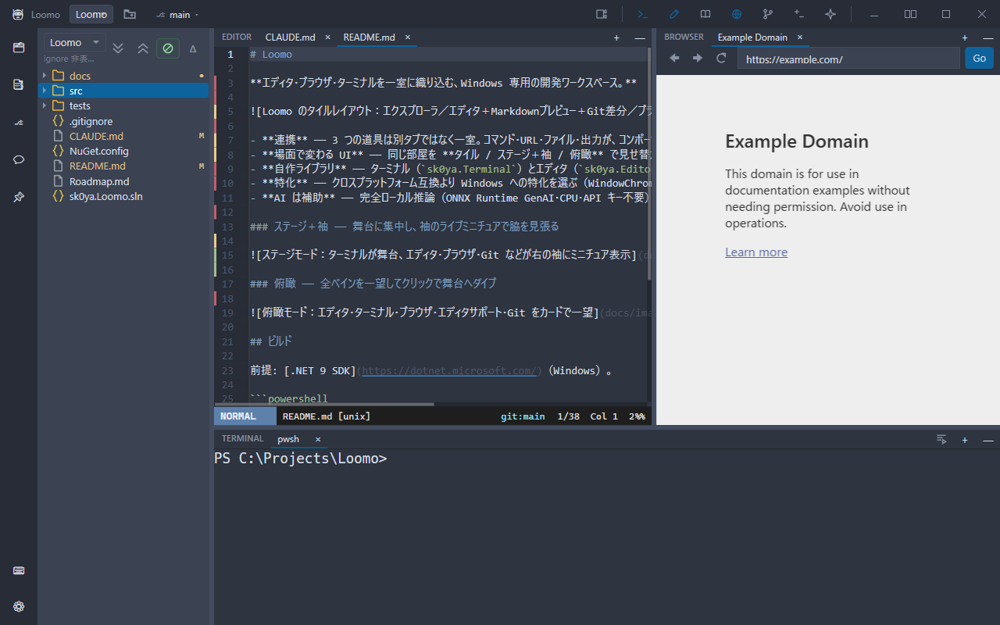

# Loomo

**エディタ・ブラウザ・ターミナルを一室に織り込む、Windows 専用の開発ワークスペース。**

標準は **ステージモード** ── 1 つを全面の「舞台」に立て、残りは右端の「袖」でライブミニチュア表示する。



- **連携** ── 3 つの道具は別タブではなく一室。コマンド・URL・ファイル・出力が、コンポーザ／ペグボードを通じてエディタ⇔ターミナル⇔ブラウザを流れる。
- **場面で変わる UI** ── 同じ部屋を **タイル / ステージ＋袖 / 俯瞰** で見せ替える。ワークスペースに合った表現を選べる。
- **自作ライブラリ** ── ターミナル（`sk0ya.Terminal`）とエディタ（`sk0ya.Editor`）は自作。既存アプリの責務に縛られず、OSC133 の活動バッジや素材の流れまで拡張できる。
- **特化** ── クロスプラットフォーム互換より Windows への特化を選ぶ（WindowChrome / WebView2 / ConPTY / DPAPI）。
- **AI は補助** ── 完全ローカル推論（ONNX Runtime GenAI・CPU・API キー不要）のエージェントが、長い手作業を肩代わりする。

### 俯瞰 ── 全ペインを一望してクリックで舞台へダイブ



### タイル ── 全ペインを 2D に自由配置・分割・リサイズ



## ビルド

前提: [.NET 9 SDK](https://dotnet.microsoft.com/)（Windows）。

```powershell
dotnet build sk0ya.Loomo.sln
dotnet run --project src/Loomo.App/Loomo.App.csproj
dotnet test
```

## もっと詳しく

- 設計の正本: [`docs/設計書.md`](docs/設計書.md)（ステージ・袖・素材の流れは §21〜§24）
- エージェントループの性能知見: [`docs/エージェントループ知見.md`](docs/エージェントループ知見.md)
- 開発ガイド: [`CLAUDE.md`](CLAUDE.md)

> 名前の由来 = **Loom**（織機＝複数の道具を一枚に織り上げる）× **Room**（作業空間）。
